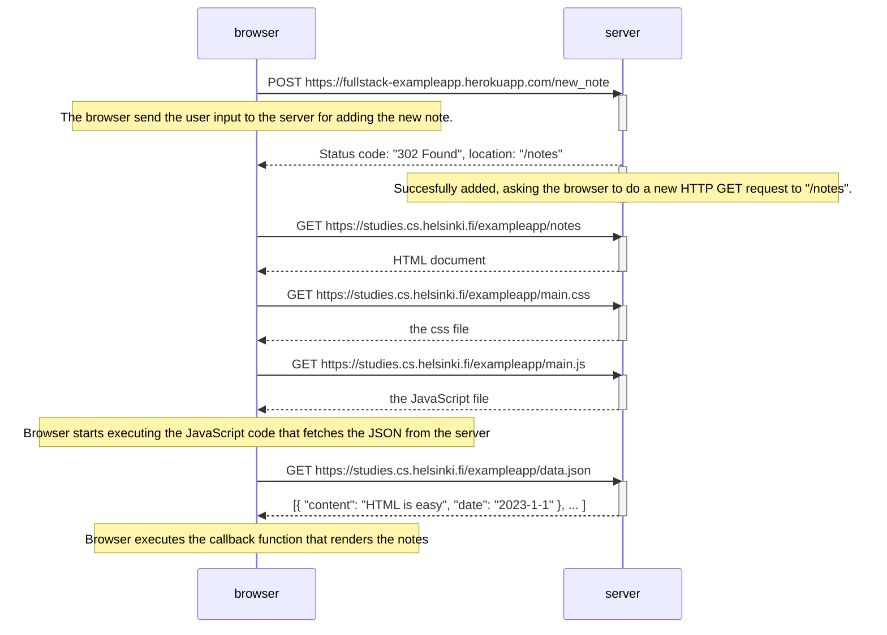

# 0.4 New note diagram

## Info
This Diagram depicts how user creating a new note and hitting the Save button, following the [example](https://fullstackopen.com/static/15a8e6a030a5d6b3d2b4b459c3f2f10f/5a190/19m.png).

## Diagram

## Built With
[Mermaid | Diagramming and charting tool](https://mermaid.js.org/)