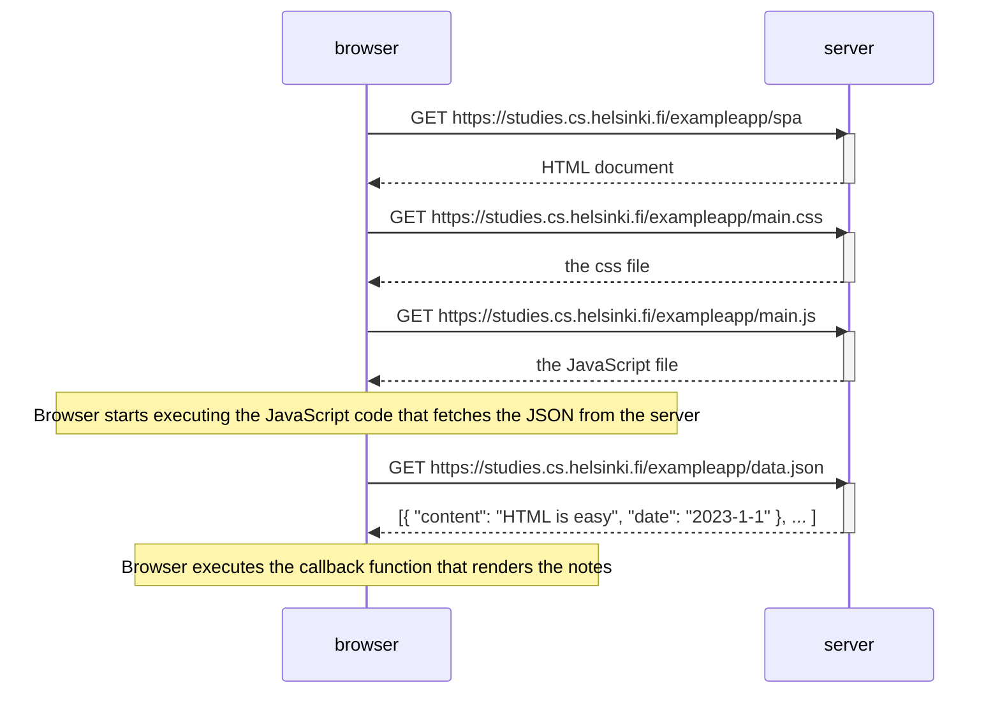

# 0.5 Single page app diagram

## Info
This Diagram depictis the situation when user visit [the SPA version of the notes application](https://studies.cs.helsinki.fi/exampleapp/spa).

## Diagram

## Built With
[Mermaid | Diagramming and charting tool](https://mermaid.js.org/)